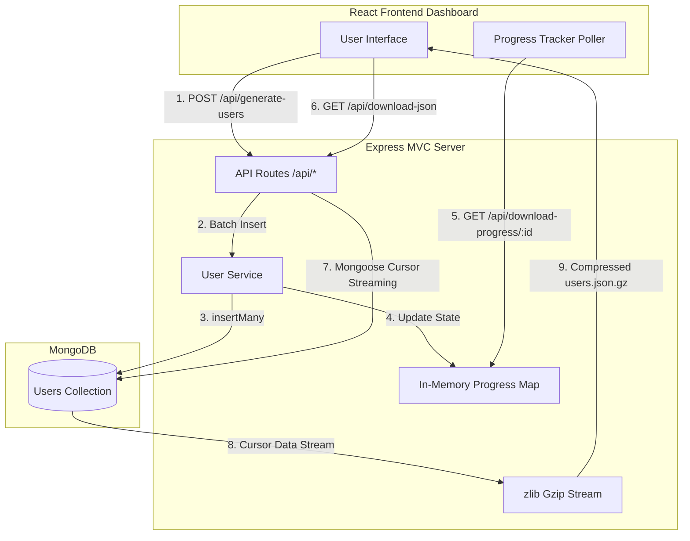

# 🚀 DataStream Pro

<p align="center">
  <b>High-Performance Bulk Data Generator & Memory-Efficient Stream Exporter</b>
</p>

<p align="center">
  
  
  
  
  
</p>

---

## 📌 Overview

**DataStream Pro** is a full-stack, high-throughput data processing application engineered to generate, manage, and stream massive datasets (1,000,000+ records) without crashing server memory or browser memory limits. 

By leveraging **MongoDB Cursor Streaming** combined with **Node.js `zlib` Gzip Compression**, DataStream Pro streams data on-the-fly directly to the client as a `.json.gz` file while reporting live, real-time progress metrics (percentage, processing speed, elapsed time, and ETA).

---

## ✨ Key Features

- ⚡ **Large-Scale Mock Data Generation**: Generate 100K to 1,000,000+ realistic user records using `@faker-js/faker` with optimized batch inserts (`insertMany`).
- 🗜️ **On-the-Fly Gzip Stream Export**: Stream millions of documents directly from MongoDB cursors through Gzip compression to HTTP response streams with zero RAM spikes.
- 📈 **Real-Time Progress & Analytics**: Monitor active background tasks with live updates:
  - Completion Percentage (`0%` - `100%`)
  - Records Processed / Total Documents
  - Processing Speed (`docs/sec`)
  - Elapsed Time & Estimated Time Remaining (ETA)
- 🏗️ **Clean MVC Backend Architecture**: Separated into controllers, services, models, routes, and utilities for maintainability and scalability.
- 💻 **Modern Interactive Dashboard**: Built with React & Vite, featuring backend connection diagnostics, database stats, one-click dataset resets, and smooth visual progress bars.

---

## 🛠️ Tech Stack

| Domain | Technology | Description |
| :--- | :--- | :--- |
| **Frontend** | React 18, Vite, Axios, Tailwind CSS | High-performance SPA with live progress updates |
| **Backend** | Node.js, Express.js (ES Modules) | RESTful API server with streaming capabilities |
| **Database** | MongoDB, Mongoose | NoSQL database with cursor-based streaming |
| **Data Generation** | `@faker-js/faker` | Synthetic user data generation |
| **Compression** | Node.js `zlib` Stream | Dynamic HTTP response Gzip compression |

---

## 🏗️ Architecture & Data Flow



---

## 📁 Project Structure

```
DataStream-Pro/
├── backend/
│   ├── src/
│   │   ├── controllers/      # Request handlers (user, progress)
│   │   ├── models/           # Mongoose schemas (User model)
│   │   ├── routes/           # Express API endpoints
│   │   ├── services/         # Business logic (database, user stream, progress)
│   │   └── utils/            # Faker data generators
│   ├── .env                  # Environment variables
│   ├── app.js                # Express app configuration & middleware
│   ├── server.js             # Server startup & DB connection
│   └── package.json
├── frontend/
│   ├── src/
│   │   ├── components/       # DownloadProgressBar & UI components
│   │   ├── App.jsx           # Main application view
│   │   └── main.jsx          # Entry point
│   ├── index.html
│   └── package.json
├── .gitignore                # Git ignore configuration
└── README.md                 # Project documentation
```

---

## 📡 API Reference

| Method | Endpoint | Description |
| :--- | :--- | :--- |
| `GET` | `/api/health` | Check backend server & database status |
| `GET` | `/api/database-stats` | Retrieve total users, database name, and collection stats |
| `POST` | `/api/generate-users` | Trigger background generation of fake user records |
| `GET` | `/api/download-progress/:id` | Poll generation or streaming export progress |
| `GET` | `/api/download-json` | Stream MongoDB documents as a compressed `users.json.gz` |
| `DELETE` | `/api/clear-users` | Purge all user records from database |

---

## 🚀 Getting Started

### Prerequisites
- **Node.js**: v18.0.0 or higher
- **MongoDB**: Local MongoDB instance running on `mongodb://localhost:27017` or a MongoDB Atlas URI.

---

### 1. Backend Setup

```bash
# Navigate to backend directory
cd backend

# Install dependencies
npm install

# Configure environment variables (.env)
# Create a .env file inside backend/ directory:
MONGO_URI=mongodb://localhost:27017/Progress-Bar
PORT=3000

# Start development server with Nodemon
npm run dev
```
> Server runs at `http://localhost:3000`

---

### 2. Frontend Setup

```bash
# Navigate to frontend directory
cd frontend

# Install dependencies
npm install

# Start Vite development server
npm run dev
```
> Dashboard runs at `http://localhost:5173`

---

### 3. Vercel Deployment (Unified Frontend + Backend)

1. Push your code to GitHub.
2. Import the repository on [Vercel](https://vercel.com).
3. Set the Environment Variable in Vercel settings:
   - `MONGO_URI` = `mongodb+srv://<user>:<password>@cluster.mongodb.net/<dbname>`
4. Click **Deploy**. Vercel will automatically build both the React frontend and serverless Node.js Express backend in one single deployment!

---

## ⚡ Performance Optimization Highlights

1. **Batching**: User generation processes records in controlled batches of `10,000` to maximize Mongo insert speed while keeping memory usage stable.
2. **Cursor Streaming**: `User.find().cursor({ batchSize: 5000 })` processes MongoDB documents sequentially without loading millions of objects into V8 heap memory.
3. **HTTP Compression Header**: Sets `Content-Encoding: gzip` so browser file download consumes minimal network bandwidth.

---

## 📝 License

This project is open-source and available under the **MIT License**.
